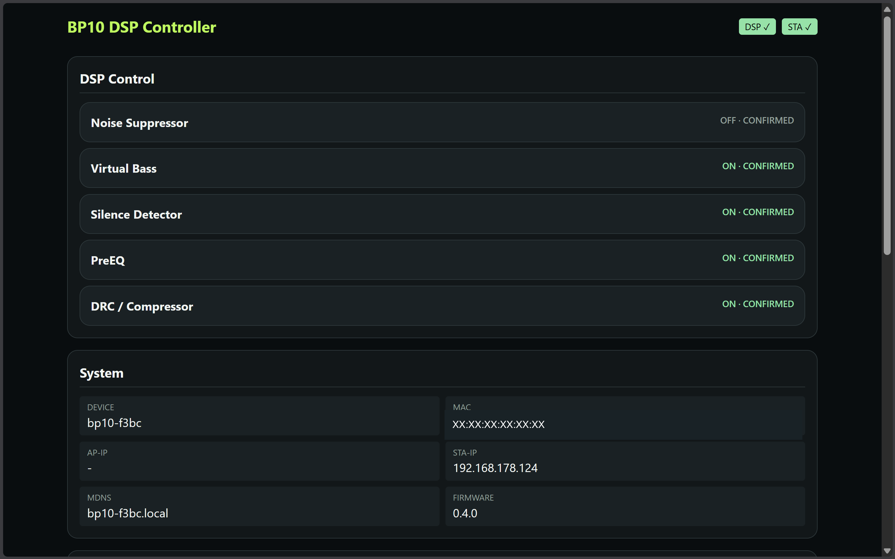
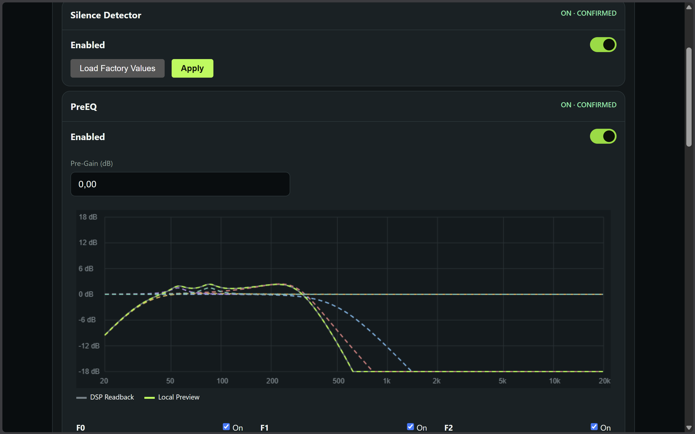
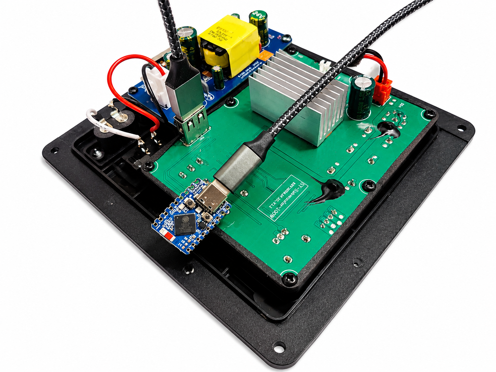

# BP10 DSP Controller

BP10 DSP Controller is an independent ESP32-S3 USB host controller for selected
MVSilicon BP10/BP1048 DSP devices. It provides a small local web interface for
the DSP functions used by supported subwoofer boards.

## Functions

Depending on the connected DSP, the controller provides:

- Music Pre EQ
- Music Noise Suppressor
- Virtual Bass
- Music DRC
- Silence Detector, when supported
- Wi-Fi setup with network scanning
- automatic restoration of saved A800X settings after power-on
- A800X configuration backup and restore
- factory reset
- firmware updates through the web interface

For the A800X, DSP settings are stored on the ESP32 and reapplied after a
restart or DSP reconnect. They are not written to the DSP's internal flash.

Generic ACP profiles currently support live DSP control. DSP setting storage,
automatic restore, and configuration import/export are not yet enabled for
Generic ACP because the saved configuration format is not yet tied to a
specific detected device and DSP schema. Wi-Fi settings and factory reset work
independently of the connected DSP profile.



### Pre EQ response

The Pre EQ editor provides a visual frequency-response preview for the active
filter configuration.



## Supported hardware

### ESP32-S3 target

BP10 DSP Controller runs on ESP32-S3 boards. It has been tested with:

- a compact ESP32-S3 Mini with 4 MB flash and 2 MB PSRAM
- an ESP32-S3 development board with 16 MB flash and 8 MB PSRAM

More flash or PSRAM is not a problem. The DSP connection uses the ESP32-S3
native USB data pins: GPIO 20 for D+ and GPIO 19 for D-. In the tested hardware,
the DSP board is self-powered; the ESP32 does not supply its 5 V power.



### DSP devices

- **AIYIMA A800X (`0x8888:0x171E`):** tested fixed profile
- **Generic MVSilicon ACP (`0x8888:0x1719`):** experimental automatic effect
  discovery; physical validation on the additional board is still pending

Only recognized functions are shown in the web interface.

## Install the prebuilt firmware

The easiest method is Espressif's browser-based flasher.

1. Download `bp10-dsp-controller-full.bin` from the latest GitHub release.
2. Open `https://espressif.github.io/esptool-js/` in Chrome or Edge.
3. Connect the ESP32-S3 to the computer with a USB data cable and select its
   serial port.
4. Add the downloaded file at flash address **`0x0`** and start programming.
5. Restart the board after flashing.

When the board is not detected, hold **BOOT** while connecting or resetting it
to enter download mode. Do not use the smaller OTA application image for the
first installation.

## First Wi-Fi setup

1. Connect to the open Wi-Fi network `bp10-xxxx`.
2. Open `http://192.168.4.1`.
3. Scan for networks and enter the home-network password.
4. Open the controller using the displayed IP address or
   `http://bp10-xxxx.local`.

The setup access point is disabled after a successful home-network connection.
It returns after a factory reset or when the saved network cannot be reached.

## Build from source

The tested toolchain is **ESP-IDF 6.0.2**.

```bash
idf.py set-target esp32s3
idf.py build
idf.py merge-bin -o bp10-dsp-controller-full.bin
```

`merge-bin` runs in the build directory, so the command above creates
`build/bp10-dsp-controller-full.bin`.

The application-only image for updates is:

```text
build/bp10_dsp_controller.bin
```

Run the host regression tests with:

```bash
tests/host/run.sh
```

## Network note

The web interface is intended for a trusted local network and currently has no
login. Devices on the same network can access its control and update API.

## License

Copyright 2026 CobbyCode.

This project is licensed under the GNU General Public License v3.0 or later.
See [LICENSE](LICENSE).

## Disclaimer

This is an independent open-source project. It is not affiliated with,
endorsed by, or supported by MVSilicon, AIYIMA, or any other hardware
manufacturer.

Use the firmware at your own risk.
